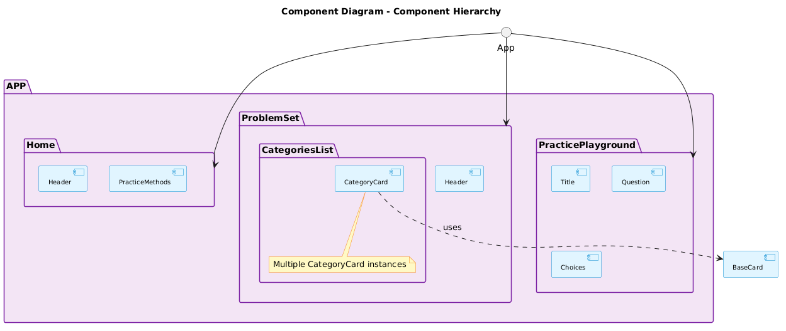
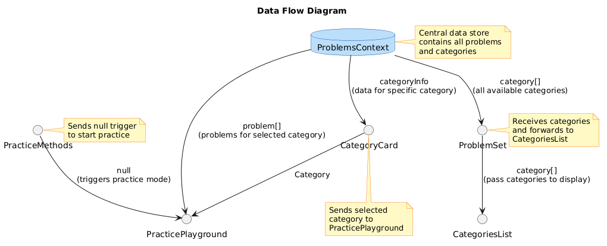
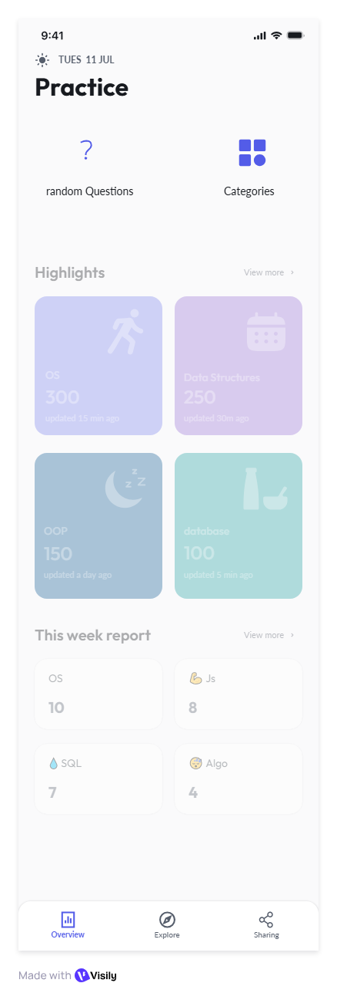
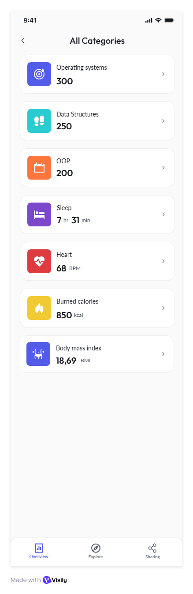
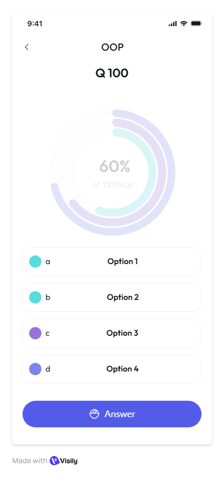

# Recall - Interview Preparation App

A React Native mobile application built with Expo to help users prepare for technical interviews through interactive practice questions across various categories.

## Features

- **Interactive Practice Sessions**: Answer multiple-choice questions with immediate feedback
- **Category-Based Learning**: Organized questions by topics like Operating Systems, Data Structures, OOP, etc.
- **Progress Tracking**: Track your performance and improvement over time
- **Offline Support**: Practice without internet connection
- **Modern UI**: Clean, intuitive interface using React Native Paper components

## Tech Stack

- **Framework**: React Native with Expo
- **Navigation**: Expo Router (file-based routing)
- **State Management**: React Query for server state management
- **UI Components**: React Native Paper
- **HTTP Client**: Axios
- **Language**: TypeScript
- **Build Tool**: EAS Build

## Prerequisites

- Node.js (version 24.15.0 as specified in volta)
- Expo CLI
- Android Studio (for Android development)
- Xcode (for iOS development, macOS only)

## Installation

1. **Clone the repository**
   ```bash
   git clone <repository-url>
   cd recall
   ```

2. **Install dependencies**
   ```bash
   npm install
   ```

3. **Start the development server**
   ```bash
   npm start
   ```

4. **Run on specific platform**
   ```bash
   # Android
   npm run android

   # iOS (macOS only)
   npm run ios

   # Web
   npm run web
   ```

## Project Structure

```
src/
├── app/                    # App screens (expo-router)
│   ├── _layout.jsx        # Root layout
│   ├── index.tsx          # Home screen
│   ├── categories.tsx     # Categories list
│   └── practiceGround.tsx # Practice session
├── components/            # Reusable UI components
│   ├── AnswerOption.tsx
│   ├── Answers.tsx
│   ├── CategoryCard.tsx
│   ├── CustomButton.tsx
│   ├── Header.tsx
│   ├── IconButton.tsx
│   ├── PracticeMethods.tsx
│   └── Question.tsx
├── assets/                # Static assets
├── api/                   # API functions
│   └── getData.ts
├── colors.ts              # Color constants
├── config.ts              # App configuration
├── types.ts               # TypeScript type definitions
└── utils.ts               # Utility functions
```

## Architecture Diagrams

### Component Hierarchy


### Data Flow Diagram


## Screenshots

### Home Screen


### Problem Sets


### Practice Ground


## API Integration

The app integrates with a backend API to fetch questions and categories. The API functions are located in `src/app/api/getData.ts`.

Key API endpoints:
- `getCategories()`: Fetches available question categories
- `getAllProblems()`: Retrieves all practice questions
- `getData()`: Generic data fetching utility

## Building for Production

### Using EAS Build

1. **Install EAS CLI** (if not already installed)
   ```bash
   npm install -g eas-cli
   ```

2. **Configure EAS**
   ```bash
   eas build:configure
   ```

3. **Build for platforms**
   ```bash
   # Android APK
   eas build --platform android

   # iOS
   eas build --platform ios
   ```

### Manual Build

For manual builds, refer to the Expo documentation for building React Native apps.

## Contributing

1. Fork the repository
2. Create a feature branch (`git checkout -b feature/amazing-feature`)
3. Commit your changes (`git commit -m 'Add some amazing feature'`)
4. Push to the branch (`git push origin feature/amazing-feature`)
5. Open a Pull Request

## License

This project is private and proprietary.

## Support

For support or questions, please contact the development team.